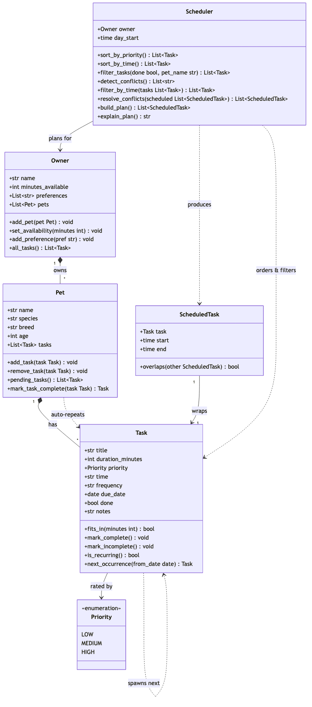

# PawPal+ (Module 2 Project)

You are building **PawPal+**, a Streamlit app that helps a pet owner plan care tasks for their pet.

## Scenario

A busy pet owner needs help staying consistent with pet care. They want an assistant that can:

- Track pet care tasks (walks, feeding, meds, enrichment, grooming, etc.)
- Consider constraints (time available, priority, owner preferences)
- Produce a daily plan and explain why it chose that plan

Your job is to design the system first (UML), then implement the logic in Python, then connect it to the Streamlit UI.

## What you will build

Your final app should:

- Let a user enter basic owner + pet info
- Let a user add/edit tasks (duration + priority at minimum)
- Generate a daily schedule/plan based on constraints and priorities
- Display the plan clearly (and ideally explain the reasoning)
- Include tests for the most important scheduling behaviors

## ✨ Features

- **Sorting by priority** — orders pending tasks HIGH → MEDIUM → LOW using a
  `Priority` IntEnum (no lookup table). `Scheduler.sort_by_priority()`
- **Sorting by time** — orders tasks chronologically by their `"HH:MM"` start
  time, parsing each to a real `time` so `"9:00"` sorts before `"10:00"` and
  untimed tasks come first. `Scheduler.sort_by_time()`
- **Filtering** — narrows tasks by completion status and/or pet name.
  `Scheduler.filter_tasks(done=…, pet_name=…)`
- **Time-budget fitting** — greedily keeps tasks while the owner's
  `minutes_available` lasts and drops the rest (sort by priority first to
  protect important tasks). `Scheduler.filter_by_time()`
- **Conflict warnings** — flags two or more tasks sharing the same start time,
  normalizing `"9:00"`/`"09:00"` to one slot and catching clashes across
  different pets — warns rather than crashing. `Scheduler.detect_conflicts()`
- **Overlap resolution** — assigns each task a concrete start/end slot and
  pushes back any that would double-book, so the built plan never overlaps.
  `Scheduler._assign_slots()` + `Scheduler.resolve_conflicts()`
- **Daily / weekly recurrence** — completing a recurring task auto-creates its
  next occurrence, dated with `timedelta` (+1 day for daily, +7 for weekly);
  future-dated follow-ups are held out of today's plan.
  `Pet.mark_task_complete()` + `Task.next_occurrence()`
- **Daily plan with explanation** — combines priority ordering, budget fitting,
  and overlap resolution into a timed schedule, plus a human-readable rationale.
  `Scheduler.build_plan()` + `Scheduler.explain_plan()`

## 📐 System Design (UML)

The class diagram below reflects the final implementation in `pawpal_system.py` —
its classes, attributes, methods, and how they interact. Source: [`diagrams/uml_draft.mmd`](diagrams/uml_draft.mmd).



## Getting started

### Setup

```bash
python -m venv .venv
source .venv/bin/activate  # Windows: .venv\Scripts\activate
pip install -r requirements.txt
```

### Suggested workflow

1. Read the scenario carefully and identify requirements and edge cases.
2. Draft a UML diagram (classes, attributes, methods, relationships).
3. Convert UML into Python class stubs (no logic yet).
4. Implement scheduling logic in small increments.
5. Add tests to verify key behaviors.
6. Connect your logic to the Streamlit UI in `app.py`.
7. Refine UML so it matches what you actually built.

## 🖥️ Sample Output

Paste a sample of your app's CLI or Streamlit output here so a reader can see what a generated plan looks like:

```
➜  ai110-module2show-pawpal-starter git:(main) ✗ python main.py
Today's Schedule
========================================
Daily plan for Jordan (90 min available):
  08:00 — Morning walk (30 min) [priority: high]
  08:30 — Feeding (10 min) [priority: high]
  08:40 — Playtime (20 min) [priority: medium]
```

## 🧪 Testing PawPal+

Run the full suite from the project root:

```bash
python -m pytest
```

All 28 tests live in `tests/test_pawpal.py` and pass:

```
(.venv) ➜  ai110-module2show-pawpal-starter git:(main) ✗ python -m pytest
========================= test session starts ==========================
platform darwin -- Python 3.11.3, pytest-9.1.1, pluggy-1.6.0
rootdir: /Users/adrianlujo/aiproj3/ai110-module2show-pawpal-starter
plugins: anyio-4.14.1
collected 28 items

tests/test_pawpal.py ............................                [100%]

========================== 28 passed in 0.04s ==========================
```

### What the tests cover

- **Time-budget enforcement** — the scheduler keeps tasks only while the owner's `minutes_available` lasts and drops the rest, including a zero budget, a single task larger than the whole budget, and the greedy fallback that skips an unaffordable task to keep a smaller one.
- **Priority ordering** — `sort_by_priority()` returns pending tasks strictly HIGH → MEDIUM → LOW, and `build_plan()` protects a HIGH task by dropping a LOW one when time is tight.
- **Sorting correctness** — `sort_by_time()` returns tasks in true chronological order (untimed first, and `"9:00"` correctly before `"10:00"`).
- **Recurrence logic** — completing a `daily` task spawns a follow-up due +1 day, `weekly` → +7 days, a one-off spawns nothing, and re-completing an already-done task does **not** create a duplicate.
- **Conflict detection** — `detect_conflicts()` flags two tasks sharing a start time (including across different pets and equivalent formats like `"09:00"` vs `"9:00"`), while ignoring done/untimed tasks and never crashing.
- **Overlap resolution** — `resolve_conflicts()` pushes back duration overlaps so no two slots in a built plan ever double-book.
- **Edge cases & fixed bugs** — empty owners/pets, case-insensitive frequency (`"Daily"`), a late-night task that no longer wraps past midnight, and future-dated follow-ups correctly held out of today's plan. Each of these is a regression test guarding a bug that was found and fixed.

### Confidence Level: ★★★★☆ (4 / 5)

All 28 tests pass and cover every core scheduling behavior — budgeting, priority, sorting, recurrence, and conflict handling — including six edge-case bugs that were caught and fixed with regression tests. Confidence is a strong 4 rather than 5 because coverage is at the unit level only: there are no integration tests for the Streamlit UI (`app.py`), and a couple of deliberate design simplifications remain (e.g. a task spilling past midnight is clamped to end-of-day rather than scheduled across days).

## 📐 Smarter Scheduling

PawPal+ goes beyond a flat to-do list. All logic lives in `pawpal_system.py`.

| Feature | Method(s) | Notes |
|---------|-----------|-------|
| Sorting | `Scheduler.sort_by_time()`, `Scheduler.sort_by_priority()` | Order tasks chronologically or by importance |
| Filtering | `Scheduler.filter_tasks()`, `Scheduler.filter_by_time()` | By pet name / completion status, or by the owner's time budget |
| Conflict detection | `Scheduler.detect_conflicts()` | Warns (never crashes) when tasks share a start time |
| Recurring tasks | `Pet.mark_task_complete()`, `Task.next_occurrence()` | Completing a daily/weekly task spawns its next occurrence |

### Sorting behavior

- **`Scheduler.sort_by_time()`** returns all of the owner's tasks sorted earliest-first by their `"HH:MM"` start time. Each time is parsed into a real `time` value before sorting, so chronological order holds even for non-zero-padded input like `"9:00"` (which a plain string sort would wrongly place after `"10:00"`). Tasks with no time set sort first.
- **`Scheduler.sort_by_priority()`** returns the owner's *pending* tasks sorted highest-priority first, using the `Priority` enum (`HIGH > MEDIUM > LOW`).

### Filtering behavior

- **`Scheduler.filter_tasks(done=None, pet_name=None)`** filters the owner's tasks by completion status and/or pet name. Passing `done=False` keeps only pending tasks, `pet_name="Mochi"` keeps only that pet's tasks, and `None` on either argument ignores that filter.
- **`Scheduler.filter_by_time()`** greedily keeps tasks that fit within the owner's available minutes, dropping the rest — so sorting by priority first protects the important tasks.

### Conflict detection logic

- **`Scheduler.detect_conflicts()`** normalizes each pending task's start time to a canonical `"HH:MM"` form (so `"9:00"` and `"09:00"` are treated as the same slot), groups tasks by that slot, and returns a list of warning strings for any slot holding two or more tasks. It catches clashes across *different* pets as well as within one pet, skips done/timeless tasks, and returns an empty list when nothing collides — so it warns rather than crashing the program.
- Note: the detector only flags tasks sharing the *same start time*; the plan itself resolves duration overlaps separately via `Scheduler.resolve_conflicts()`, which pushes overlapping slots back so nothing double-books.

### Recurring task logic

- **`Pet.mark_task_complete(task)`** marks a task done and, if it recurs, automatically creates and attaches its next occurrence to the pet, returning the new task (or `None` for a one-off).
- **`Task.next_occurrence()`** produces the follow-up task with a fresh due date computed with `timedelta` — today + 1 day for `"daily"`, today + 7 days for `"weekly"`.

## 📸 Demo Walkthrough

Launch the interactive app with `streamlit run app.py`. It opens seeded with
owner **Jordan** and one dog, **Mochi** — enough to explore without any setup.

### What you can do in the UI

- **Owner** — edit the owner's name and set **minutes available today** (the
  daily time budget the scheduler plans against).
- **Add a Pet** — name a new pet and pick its species (dog / cat / other); it's
  auto-selected as the active pet once added.
- **Active pet** — switch which pet you're adding tasks to.
- **Tasks** — add a task with a title, duration (minutes), priority
  (low / medium / high), and an optional `HH:MM` start time. Added tasks persist
  across reruns and show in a per-pet table.
- **All Tasks (across pets)** — sort every task by **priority** or **time**, and
  filter by status (**all / pending / completed**).
- **Conflict Check** — a live banner listing any tasks that share a start time,
  or a green all-clear when none collide.
- **Build Schedule** — generate today's timed plan and expand **"Why this
  plan?"** to see the reasoning.

### Example workflow

1. Set **minutes available today** to `90`.
2. Under **Add a Pet**, add a cat named **Biscuit**.
3. With Mochi active, add **Morning walk** — 30 min, high, `07:00`.
4. Switch the active pet to Biscuit and add **Playtime** — 20 min, medium,
   `12:15` — then add **Vet call** for Mochi at the same `12:15`.
5. Open **Conflict Check**: it warns that Vet call (Mochi) and Playtime
   (Biscuit) clash at 12:15 — a conflict caught *across two different pets*.
6. In **All Tasks**, sort by **time** to see tasks reordered chronologically
   (07:00 → 12:15 → …), then filter to **pending** to hide completed ones.
7. Click **Generate schedule**: high-priority tasks are placed first, the 12:15
   overlap is pushed back so nothing double-books, and the plan is explained.

### Key Scheduler behaviors on display

- **Sorting** — chronological (`sort_by_time()`) and by importance
  (`sort_by_priority()`), even for non-zero-padded times like `"9:00"`.
- **Filtering** — by completion status and by pet, plus greedy time-budget
  fitting that drops tasks once the 90-minute budget runs out.
- **Conflict warnings** — same-start-time clashes flagged across pets, warning
  rather than crashing.
- **Overlap resolution** — the built plan pushes back duration overlaps so no
  two slots collide.
- **Recurrence** — completing the `daily` Feeding task auto-spawns its next
  occurrence, dated one day out.

### Sample CLI output

The same logic runs headless via `python main.py`, which builds a sample owner,
pets, and tasks — including a deliberate cross-pet clash at 12:15 and a
recurring daily task — then prints each behavior:

```
Recurring task
========================================
  Completed: Feeding (daily)
  Auto-created next: Feeding due 2026-07-08

Schedule conflicts
========================================
  WARNING: 2 tasks scheduled at 12:15 — Vet call (Mochi), Playtime (Biscuit)

Today's Schedule
========================================
Daily plan for Jordan (90 min available):
  07:00 — Morning walk (30 min) [priority: high]
  12:15 — Vet call (15 min) [priority: high]
  12:30 — Playtime (20 min) [priority: medium]

All tasks sorted by time
========================================
  06:45 — Feeding (done)
  06:45 — Feeding (pending)
  07:00 — Morning walk (pending)
  12:15 — Vet call (pending)
  12:15 — Playtime (pending)
  16:30 — Grooming (pending)

Pending tasks only
========================================
  16:30 — Grooming
  07:00 — Morning walk
  12:15 — Vet call
  12:15 — Playtime
  06:45 — Feeding

Tasks for Mochi only
========================================
  16:30 — Grooming
  07:00 — Morning walk
  12:15 — Vet call
```
